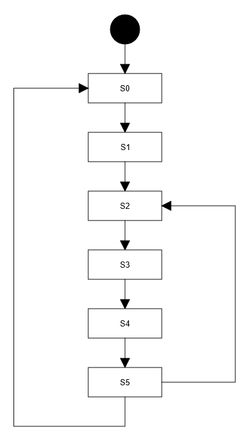

# StateMachine
This library implements a basic State Machine. The state logic and its transition's conditions are implemented as functions in your sketch for flexibility. The machine is intended to be deterministic, meaning that you can only be in one state at the time and transitions should occur only when your transition condition functions return true. Please note that if multiple transitions are defined for a state the first one to evaluate to true is the one that modifies the current state.

This implementation relies on LinkedList (https://github.com/ivanseidel/LinkedList) to implement the collection of states and the collection of transitions for a state.

## STATES
There are two ways of declaring a state logic:
1. Through a lambda function (an anonymous function) declared in the addState() method.
2. Defining the function normally and passing the address to the addState() method.
 
States contain the machine logic of the program. The machine only evaluates the current state until a transition occurs that points to another state.

To evaluate a piece of code only once while the machine is in a particular state, you can use the machine.evaluateOnce attribute. It is true each time the machine enters a new state until the first transition is evaluated.

## TRANSITIONS
Each state has transitions defined in setup(). Transitions require two parameters, 
1. The transition test function that returns a boolean value indicating whether or not the transition occured, 
2. The number of the target state. The target state can also be specified passing the state pointer. This could point to the same state it is in, if you want to dynamically set the transition target. To do so, use state->setTransition(). You must pass the index of the transition you want to modify and the number of the target state.

Transitions are evaluated by the state machine after the state logic has executed. If none of the transitions evaluate to true, then the machine stays in the current state. 

## EXAMPLE



```c++
#include <StateMachine.h>

const int STATE_DELAY = 1000;
int randomState = 0;
const int LED = 13;

StateMachine machine = StateMachine();

State* S0 = machine.addState(&state0); 
State* S1 = machine.addState(&state1);
State* S2 = machine.addState(&state2);
State* S3 = machine.addState(&state3);
State* S4 = machine.addState(&state4);
State* S5 = machine.addState(&state5);

void setup() {
  Serial.begin(115200);
  pinMode(LED,OUTPUT);
  randomSeed(A0);

  S0->addTransition(&transitionS0,S0);    // Transition to itself (see transition logic for details)
  S1->addTransition(&transitionS1S2,S2);  // S1 transition to S2
  S2->addTransition(&transitionS2S3,S3);  // S2 transition to S3
  S3->addTransition(&transitionS3S4,S4);  // S3 transition to S4
  S4->addTransition(&transitionS4S5,S5);  // S4 transition to S5
  S5->addTransition(&transitionS5S0,S0);  // S5 transition to S0
  S5->addTransition(&transitionS5S2,S2);  // S5 transition to S2
}

void loop() {
  machine.run();
  delay(STATE_DELAY);
}
```

### States

The state logic is defined in a function that is passed as a parameter to the ``` machine.addState() ``` method.

```c++
State* S0 = machine.addState(&state0); 
```
Here, **state0** is the name of the function that defines S0 logic. The function must be defined in the sketch, for example:

```c++
void state0(){
  Serial.println("State 0");
  if(machine.executeOnce){
    Serial.println("Execute Once");
    digitalWrite(LED,!digitalRead(LED));
  }
}
```
### State Execute Once

If you need to execute a portion of code within a state just once, you can use the machine attribute ```executeOnce```. This attribute is true the first time a state logic is evaluated and then becomes false until a transition to a new state occurs. In the example above, the LED is toggled once every time the machine enters state S0.  

### Transitions

Transitions are added to the states in the setup() function. When specifying a transition of a state you pass the name of the function that evaluates the transition and the state object you want the machine to transition to when it evaluates to true.

```c++
  S1->addTransition(&transitionS1S2,S2);  // S1 transition to S2
```

The transitions are implemented by evaluating a function that returns a bool value of true or false. If the function returns **true** then the machine will transition from the current state to the state specified when the transition was added in setup().

```c++
bool transitionS1S2(){
  if(digitalRead(5) == HIGH){
    return true;
  }
  return false;
}
```

Each state can have multiple transitions, and when the state is active (current state of the machine) all of its transitions are evaluated to determine the next active state. When a state has multiple transitions, the transitions are evaluated in the order they were added to the state. The first transition to return true will determine the next active state.

### Transition to any state

You can also force a transition to any state by calling the method ```transitionTo(State* s)```. This method accepts either a pointer to a specific state or an int that represents the state index. The easiest way is to use the pointer. For example,

```c++
 machine.transitionTo(S4);
```

When this line is evaluated the machine will unconditionally transition to S4.

### Modifying a transition target

You can also dynamically modify the transition target of a defined transition by using the ```setTransition(int index, int stateNo)``` method.

```c++
  randomState = random(0,6);
  Serial.print("Transitioning to random state ");
  Serial.println(randomState);
  S0->setTransition(0,randomState);
```

In this example, the first transition (0) added to S0 is assigned a random target from 0 to 5. Assuming the machine has 6 or more states, the first transition in S0 now points to a different state each time this code is executed.
